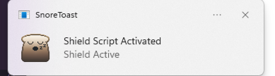
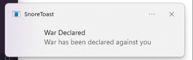

**Script Startup Notification**

**Desktop Notification on War Declaration**

How to use:
- Create .env file
   - Paste API_KEY= "[Insert API Key]"
     
- Place script at windows startup folder
  - Press Windows Key + R & Type shell:startup
  - Paste/Move folder into folder
